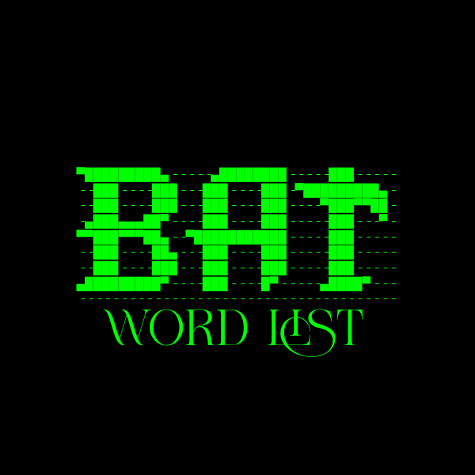

# BAT 1.0v
#wordlist #game #password #top10 #basic


## 🛠️ Python Basic Word List Generator Tool

This is a **basic word list generator tool** written in Python. It randomly generates combinations of custom characters and words, and saves them to a `.txt` file. This can be useful for testing, dictionary attacks, CTF challenges, or penetration testing tools.

---

## 🔥 Features

- Random wordlist generation using custom words/symbols
- Skips unwanted patterns (like `@@`, `##`, etc.)
- Generates **3900+ entries**
- Saves the wordlist to a `.txt` file
- Simple and fast

---

## 📦 Requirements

- Python 3.x

No external libraries are required.

---
#🧑‍💻 Author:- lasith ruwantha Amarawasha🇱🇰
---
## 🧪 How to Use

```bash
cd bat
python bat.py
```
